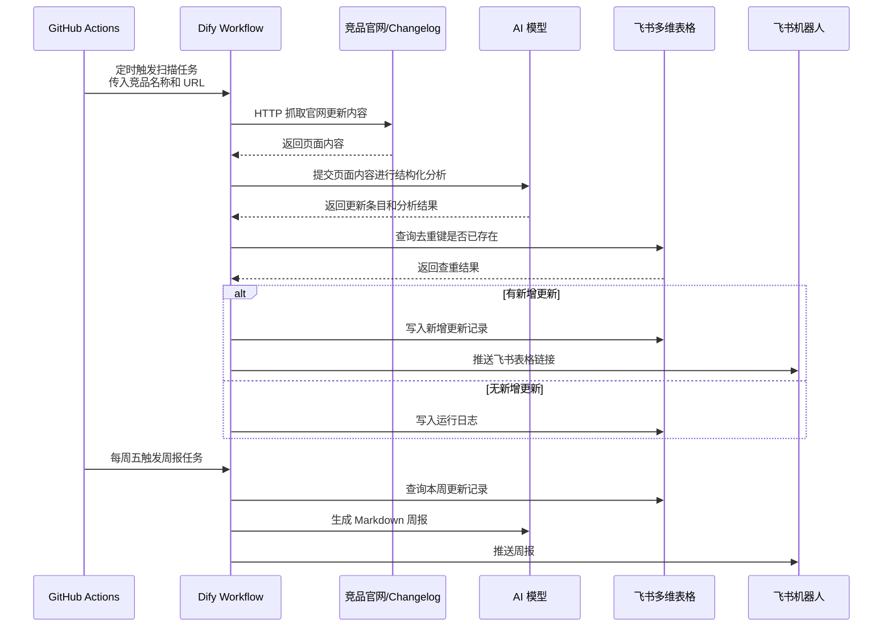

# 竞品更新自动监控工作流 PRD

## 1. 项目目标

搭建一个最小 MVP 工作流，用于自动监控 AI 编程工具竞品更新，并将结果沉淀到飞书多维表格中，辅助 zcode 进行竞品观察和产品判断。

核心目标：

- 定时抓取竞品官网更新信息
- 使用 AI 进行结构化分析
- 写入飞书多维表格
- 有新增时推送飞书机器人
- 每周生成一次竞品更新周报

## 2. 适用人群

本工作流主要服务于：

- zcode 产品负责人：跟踪竞品方向，辅助产品判断。
- 产品经理 / 增长负责人：快速了解竞品功能、定价、生态和营销动作。
- 研发负责人：关注 AI 编程工具的技术能力、模型能力和工程集成变化。
- 早期创业团队：用低成本方式建立竞品更新情报流。

## 3. 监控范围

MVP 阶段优先监控官方发布日志 / changelog。

默认竞品：

- Cursor
- Claude Code
- Codex
- GitHub Copilot

竞品和数据源需要支持通过 GitHub 配置文件灵活调整。

## 4. 核心功能

- 竞品配置管理：通过 GitHub 配置文件维护竞品名称、官网 changelog URL 和启用状态。
- 定时并行扫描：由 GitHub Actions 按固定时间触发，并按竞品并行调用 Dify。
- 官网内容抓取：Dify 使用 HTTP 请求节点抓取官方发布日志内容。
- AI 结构化分析：将原始更新内容整理为摘要、类型、详情、影响判断和建议动作。
- 飞书查重入库：基于去重键判断是否已记录，只写入新增更新。
- 飞书机器人推送：有新增时推送飞书表格链接，每周推送 Markdown 周报。
- 运行日志记录：记录每次任务的执行状态、新增数量和错误信息，便于排查。

## 5. 核心流程

```text
GitHub Actions 定时触发
→ Dify 抓取官网更新内容
→ AI 分析并结构化
→ 飞书多维表格查重与写入
→ 飞书机器人推送
```



日常扫描规则：

- 每天北京时间 09:00 和 22:00 执行
- 按竞品并行触发
- 有新增更新时推送飞书表格链接
- 无新增时不推送

周报规则：

- 每周五北京时间 16:00 生成并推送
- 周报以 Markdown 消息发送到飞书群

## 6. 系统组成与实施步骤

### 6.1 GitHub Actions

作用：

- 负责定时触发 Dify Workflow
- 维护竞品配置文件
- 按竞品并行执行扫描任务

你需要做：

1. 创建一个 GitHub 仓库，用于存放工作流配置。
2. 在仓库中维护竞品配置文件，例如：
   - 竞品名称
   - 官网 changelog URL
   - 是否启用
3. 配置 GitHub Secrets：
   - Dify API Key
   - Dify Workflow 调用地址
4. 创建 GitHub Actions 定时任务：
   - 每天 09:00、22:00 触发日常扫描
   - 每周五 16:00 触发周报
5. 使用 matrix 机制按竞品并行调用 Dify。

### 6.2 Dify Workflow

作用：

- 执行核心编排逻辑
- 抓取官网内容
- 调用 AI 分析
- 调用飞书 API 写入数据
- 调用飞书机器人推送消息

你需要做：

1. 在 Dify 中创建两个 Workflow：
   - 日常扫描 Workflow
   - 周报生成 Workflow
2. 在日常扫描 Workflow 中配置：
   - 接收 GitHub Actions 传入的竞品名称和 URL
   - 使用 HTTP 请求节点抓取页面内容
   - 使用 AI 节点分析更新内容
   - 查询飞书多维表格进行去重
   - 写入新增更新
   - 有新增时推送飞书机器人
3. 在周报 Workflow 中配置：
   - 查询本周飞书表格数据
   - 使用 AI 生成周报
   - 推送到飞书机器人
4. 在 Dify 中配置飞书相关密钥和机器人 Webhook。
5. 将 AI 分析 Prompt 设计为可配置，方便后续调整字段和分析口径。

### 6.3 飞书多维表格

作用：

- 存储竞品更新结果
- 作为去重依据
- 支撑人工查看、筛选和周报生成

你需要做：

1. 创建一个飞书多维表格。
2. 建立“竞品更新表”。
3. 建立“运行日志表”。
4. 在“竞品更新表”中配置核心字段：
   - 竞品名称
   - 更新标题
   - 发布时间
   - 摘要
   - 更新类型
   - 类型详情
   - 详细描述
   - 原文链接
   - 对 zcode 的影响
   - 建议动作
   - 人工重要性
   - 去重键
5. 在“运行日志表”中记录每次执行结果：
   - 执行时间
   - 竞品名称
   - 执行状态
   - 新增数量
   - 错误信息
6. 创建飞书自建应用，并授予多维表格读写权限。

### 6.4 飞书机器人

作用：

- 推送日常新增提醒
- 推送每周竞品周报

你需要做：

1. 在目标飞书群中创建群机器人。
2. 获取机器人 Webhook。
3. 将 Webhook 配置到 Dify。
4. 设定推送规则：
   - 日常扫描有新增时，只推送飞书表格链接
   - 无新增时不推送
   - 每周五推送 Markdown 周报

## 7. AI 分析要求

AI 分析需要围绕 zcode 展开。

zcode 当前定位：

- 集成多家 agent 和模型的 AI 编程 IDE
- 面向个人开发者
- 当前处于 MVP / 早期验证阶段

单条更新默认分析内容：

- 50 字以内摘要
- 更新类型
- 类型详情
- 200 字以内详细描述
- 原文链接
- 对 zcode 的影响
- 建议动作

重要性不由 AI 判断，保留为飞书表格中的人工字段。

## 8. 可能风险 / 错误

- 官网页面结构变化，导致 Dify HTTP 抓取结果为空或格式异常。
- 部分官网内容需要动态渲染，HTTP 直抓可能拿不到完整内容。
- AI 可能误判更新边界，导致一条更新被拆成多条，或多条更新被合并。
- 去重键依赖标题、链接和日期，如果官网修改标题或链接，可能出现重复记录。
- 飞书 API 权限、表字段类型或字段名配置错误，可能导致写入失败。
- GitHub Actions、Dify、飞书任一平台接口异常，都会影响当次任务执行。
- 周报质量依赖本周入库数据质量，如果日常抓取漏掉更新，周报也会遗漏。

## 9. 成功标准

MVP 完成后，应达到：

- 能自动按时间触发
- 能并行扫描多个竞品
- 能写入飞书多维表格
- 能避免重复记录
- 有新增时能推送飞书机器人
- 能每周生成并推送周报
- 竞品和分析字段可通过配置调整
