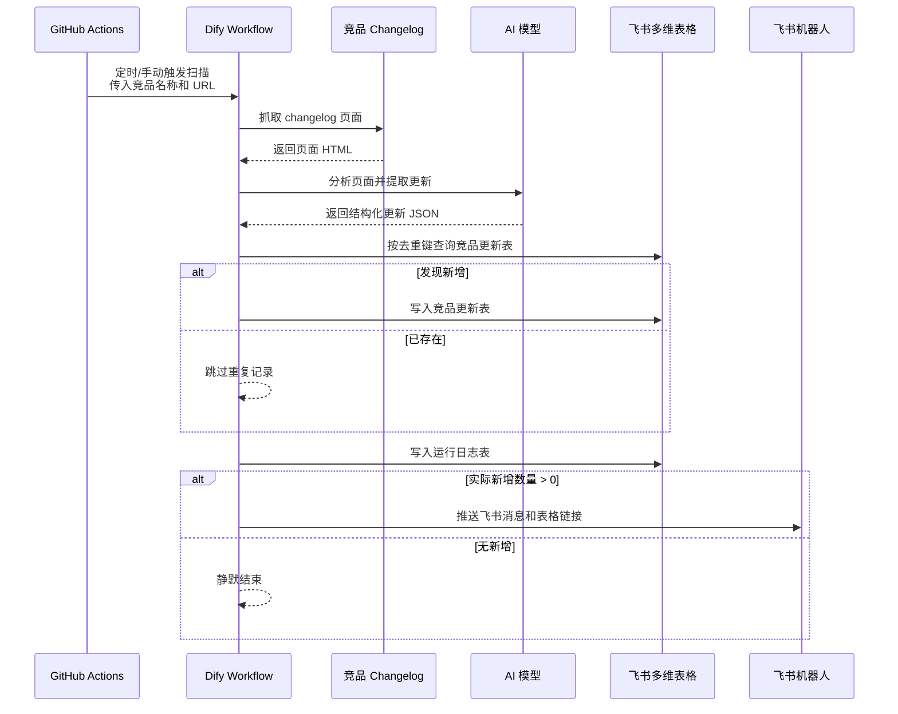

# Competitor Monitor | 竞品更新自动监控工作流

> 一款面向竞品情报跟踪的 **竞品更新自动监控与 AI 结构化分析工作流**，支持定时抓取竞品官方 changelog、AI 自动摘要与分类、飞书多维表格入库、运行日志记录和飞书机器人推送。
>

适用于产品团队、研发团队和早期创业团队持续观察 Cursor、Claude Code、Codex、GitHub Copilot 等 AI 编程工具的官方更新，辅助进行产品判断、功能规划和竞品复盘。

---

## 目录

- [功能模块预览](#功能模块预览)
- [功能介绍](#功能介绍)
- [项目定位](#项目定位)
- [工作流总览](#工作流总览)
- [功能模块详情](#功能模块详情)

## 功能模块预览

当前项目主要由以下界面组成：

- GitHub Actions：负责定时触发和按竞品并行执行。
- Dify Workflow：负责抓取、AI 分析、飞书写入和推送编排。
- 飞书多维表格：保存竞品更新数据和运行日志。
- 飞书机器人：在有新增更新时推送提醒。

## 功能介绍

- **无自建服务**：MVP 阶段不部署爬虫服务、数据库或后端 API。
- **竞品可配置**：通过 `competitors.json` 管理竞品名称、启用状态和 changelog URL。
- **自动定时扫描**：GitHub Actions 每天北京时间 09:00、22:00 自动触发。
- **AI 结构化分析**：将官网更新整理为摘要、类型、详情、影响判断和建议动作。
- **飞书自动入库**：新增更新写入飞书多维表格，便于筛选、追踪和复盘。
- **去重防重复**：基于去重键查询飞书表，避免重复写入同一条更新。
- **有新增才推送**：只有实际新增入库数量大于 0 时，才推送飞书机器人。
- **运行日志可追踪**：每次扫描都会写入运行日志，方便排查任务执行情况。

## 项目定位

该项目用于辅助跟踪 AI 编程工具领域的竞品动态。

默认监控对象：

- Cursor
- Claude Code
- Codex
- GitHub Copilot

MVP 阶段优先监控官方 changelog / release notes，不覆盖 X、B站、YouTube 等社媒数据源。

## 工作流总览

## 功能模块详情

### GitHub Actions

负责读取 `competitors.json`，按启用的竞品并行触发 Dify Workflow。

当前特点：

- 并发发生在 GitHub Actions matrix 层。
- 每个竞品会触发一次独立的 Dify run。
- 单个竞品失败不会影响其他竞品。

### Dify Workflow

负责核心业务编排：

- 抓取网页
- AI 分析
- JSON 解析
- 飞书查重
- 飞书写入
- 运行日志
- 条件推送

完整节点说明见 [Dify节点说明.md](Dify节点说明.md)。

### 飞书多维表格

包含两张表：

- `竞品更新表`：保存实际新增的竞品更新记录。
- `运行日志表`：保存每次扫描的执行状态和新增数量。

### 飞书机器人

当本次扫描实际新增数量大于 0 时，推送飞书群消息，并附带表格链接。
