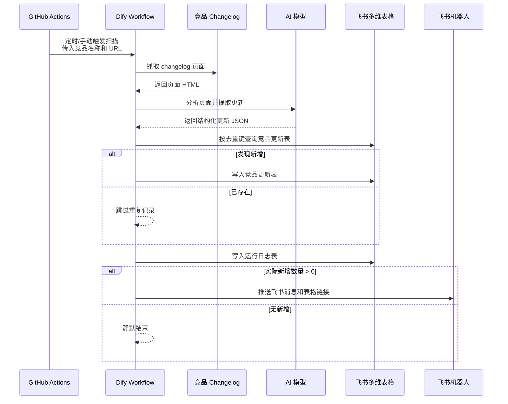

# Competitor Monitor | 竞品更新自动监控工作流

> 一款面向竞品情报跟踪的 **竞品更新自动监控与 AI 结构化分析工作流**，支持定时抓取竞品官方 changelog、AI 自动摘要与分类、飞书多维表格入库、运行日志记录和飞书机器人推送。
>
> 竞品更新会写入飞书多维表格，并通过 Dify Workflow 完成抓取、分析、查重、入库和条件推送，帮助团队以较低成本持续跟踪 AI 编程工具领域的产品动态。

适用于产品团队、研发团队和早期创业团队持续观察 Cursor、Claude Code、Codex、GitHub Copilot 等 AI 编程工具的官方更新，辅助 zcode 进行产品判断、功能规划和竞品复盘。

---

## 目录

- [功能模块预览](#功能模块预览)
- [功能介绍](#功能介绍)
- [项目定位](#项目定位)
- [工作流总览](#工作流总览)
- [功能模块详情](#功能模块详情)
- [Dify 节点说明](#dify-节点说明)
- [后续优化方向](#后续优化方向)

## 功能模块预览

当前项目主要由以下界面组成：

- GitHub Actions：负责定时触发和按竞品并行执行。
- Dify Workflow：负责抓取、AI 分析、飞书写入和推送编排。
- 飞书多维表格：保存竞品更新数据和运行日志。
- 飞书机器人：在有新增更新时推送提醒。

## 功能介绍

- **无自建服务**：MVP 阶段不部署爬虫服务、数据库或后端 API。
- **竞品可配置**：通过 `competitors.json` 管理竞品名称、启用状态和 changelog URL。
- **自动定时扫描**：GitHub Actions 每天北京时间 09:00、22:00 自动触发。
- **AI 结构化分析**：将官网更新整理为摘要、类型、详情、影响判断和建议动作。
- **飞书自动入库**：新增更新写入飞书多维表格，便于筛选、追踪和复盘。
- **去重防重复**：基于去重键查询飞书表，避免重复写入同一条更新。
- **有新增才推送**：只有实际新增入库数量大于 0 时，才推送飞书机器人。
- **运行日志可追踪**：每次扫描都会写入运行日志，方便排查任务执行情况。

## 项目定位

该项目用于辅助 zcode 跟踪 AI 编程工具领域的竞品动态。

默认监控对象：

- Cursor
- Claude Code
- Codex
- GitHub Copilot

MVP 阶段优先监控官方 changelog / release notes，不覆盖 X、B站、YouTube 等社媒数据源。

## 工作流总览

## 功能模块详情

### GitHub Actions

负责读取 `competitors.json`，按启用的竞品并行触发 Dify Workflow。

当前特点：

- 并发发生在 GitHub Actions matrix 层。
- 每个竞品会触发一次独立的 Dify run。
- 单个竞品失败不会影响其他竞品。

### Dify Workflow

负责核心业务编排：

- 抓取网页
- AI 分析
- JSON 解析
- 飞书查重
- 飞书写入
- 运行日志
- 条件推送

### 飞书多维表格

包含两张表：

- `竞品更新表`：保存实际新增的竞品更新记录。
- `运行日志表`：保存每次扫描的执行状态和新增数量。

### 飞书机器人

当本次扫描实际新增数量大于 0 时，推送飞书群消息，并附带表格链接。

## Dify 节点说明

### 1. 任务触发与内容分析

### `用户输入`

- **节点性质**：开始 / 输入节点
- **负责功能**：接收 GitHub Actions 传入的竞品名称和 changelog URL。

### `fetch_page`

- **节点性质**：HTTP 请求节点
- **负责功能**：请求竞品官网 changelog 页面，获取 HTML 内容。

### `analyze_updates`

- **节点性质**：LLM 节点
- **负责功能**：从页面 HTML 中识别最近更新，并输出中文结构化 JSON。

### `parse_analysis`

- **节点性质**：代码执行节点
- **负责功能**：解析 LLM 输出的 JSON 字符串，标准化更新数组和字段。

### 2. 飞书连接与数据入库

### `get_feishu_token`

- **节点性质**：HTTP 请求节点
- **负责功能**：调用飞书开放平台接口，获取 `tenant_access_token`。

### `parse_feishu_token`

- **节点性质**：代码执行节点
- **负责功能**：解析飞书 token 响应，提取后续 API 调用所需的访问令牌。

### `iterate_updates`

- **节点性质**：迭代节点
- **负责功能**：遍历 AI 识别出的更新数组，逐条执行查重与写入逻辑。

### `prepare_update_record`

- **节点性质**：代码执行节点
- **负责功能**：整理单条更新的数据结构，生成飞书写入所需字段。

### `search_existing_record`

- **节点性质**：HTTP 请求节点
- **负责功能**：根据去重键查询飞书“竞品更新表”，判断该更新是否已存在。

### `parse_search_result`

- **节点性质**：代码执行节点
- **负责功能**：解析飞书查重结果，输出当前更新是否已存在。

### `if_not_exists`

- **节点性质**：条件分支节点
- **负责功能**：如果当前更新不存在，则进入写入分支；如果已存在，则跳过写入。

### `create_update_record`

- **节点性质**：HTTP 请求节点
- **负责功能**：将未存在的更新写入飞书“竞品更新表”。

### 3. 新增统计与运行记录

### `mark_created`

- **节点性质**：代码执行节点
- **负责功能**：标记当前更新已成功新增，用于后续统计实际新增数量。

### `mark_skipped`

- **节点性质**：代码执行节点
- **负责功能**：标记当前更新因已存在而跳过。

### `sum_created_count`

- **节点性质**：代码执行节点
- **负责功能**：汇总本次扫描实际新增入库的更新数量。

### `build_scan_summary`

- **节点性质**：代码执行节点
- **负责功能**：整理本次扫描状态、识别数量、实际新增数量和执行时间。

### `create_run_log`

- **节点性质**：HTTP 请求节点
- **负责功能**：将本次扫描结果写入飞书“运行日志表”。

### 4. 条件推送与结果输出

### `if_has_new_records`

- **节点性质**：条件分支节点
- **负责功能**：判断实际新增数量是否大于 0，控制是否推送飞书机器人。

### `send_feishu_bot_message`

- **节点性质**：HTTP 请求节点
- **负责功能**：向飞书群机器人发送新增更新提醒和表格链接。

### `输出`

- **节点性质**：输出节点
- **负责功能**：返回本次 Dify Workflow 的最终执行摘要，便于 GitHub Actions 查看调用结果。

## 后续优化方向

- 增加页面清洗节点，减少 LLM token 消耗和超时风险。
- 优化 Prompt，明确不同竞品 changelog 的更新识别规则。
- 新增总控 Workflow，实现多竞品扫描后统一推送一条汇总消息。
- 优化飞书密钥管理，减少明文配置。
